# Strava Bulk Photo Export

[](LICENSE)
[](package.json)
[](https://ko-fi.com/D1D51ZGOQK)

A small Chrome extension that adds **bulk photo (and optional video) export** to Strava's _My Activities_ page and to individual activity pages. Filter or search the list however you like in Strava's own UI, then pull every photo (and, if you tick the checkbox, every video) attached to those activities into a single zip - original resolution, EXIF preserved, one folder per activity, never copied to any third-party service.

> **Not affiliated with Strava, Inc.** "Strava" is a trademark of Strava, Inc.

## Screenshots

<!--
Every PNG below is regenerated automatically by `npm run test:screenshots`.
Playwright drives the two fixture pages in tests/fixtures/, takes one
screenshot per state, and writes them into docs/screenshots/ (tight bounding-
box crops, used here in the README) and docs/store/ (full 1280×800 captures,
used for the Chrome Web Store listing). If you see broken-image icons in
your render, you haven't run that command yet.
-->

### Activities list page

Cropped toolbar / row shots:

| Toolbar (idle)                           | Per-row buttons                                  | Bulk download, in progress                  |
| ---------------------------------------- | ------------------------------------------------ | ------------------------------------------- |
| 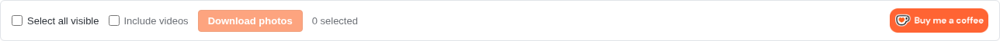 | 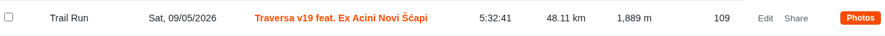 | 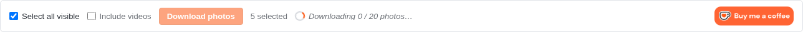 |

Full-page captures (same shots Chrome Web Store sees):

| List page, idle                                        | Bulk download, in progress,                                 |
| ------------------------------------------------------ | ----------------------------------------------------------- |
| 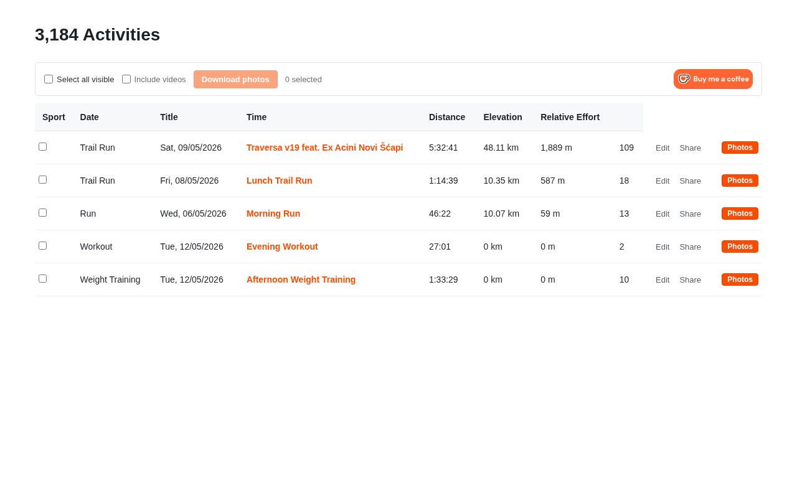 | 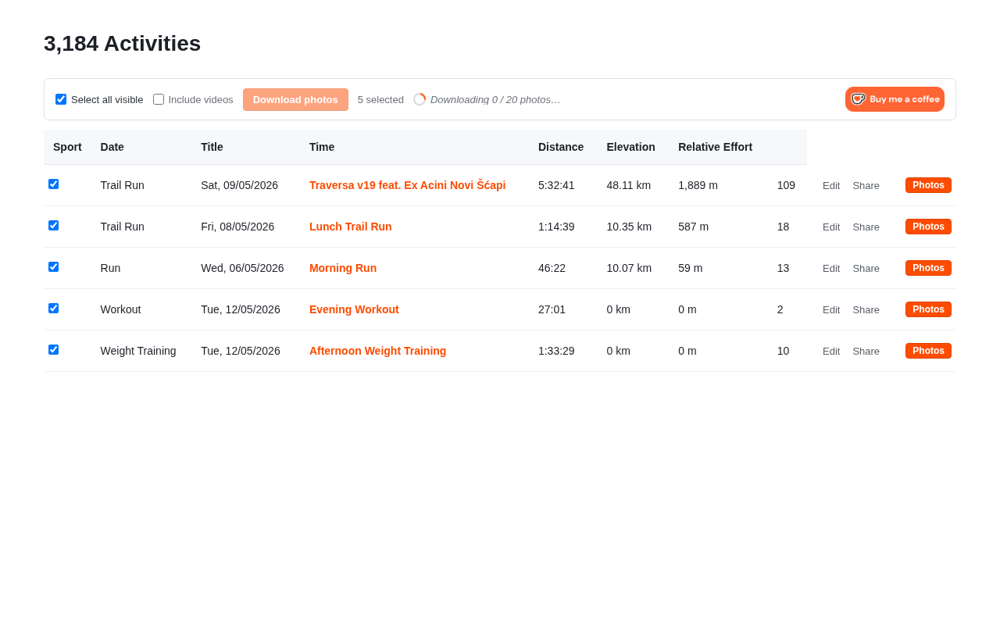 |

| Row close-up                                            | Bulk download, success                                    |
| ------------------------------------------------------- | --------------------------------------------------------- |
| 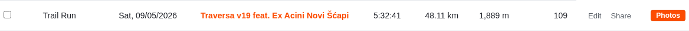 | 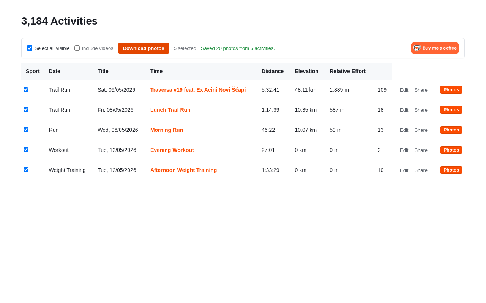 |

### Single-activity page

Cropped toolbar shots:

| Idle (status hidden)                                            | "Saved 4 photos…"                                            |
| --------------------------------------------------------------- | ------------------------------------------------------------ |
| 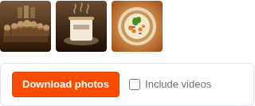 | 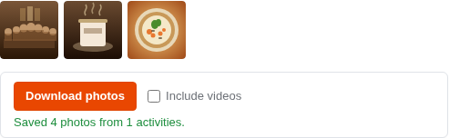 |

Full-page captures:

| Single activity, idle                                           | Single activity, success                                      |
| --------------------------------------------------------------- | ------------------------------------------------------------- |
| 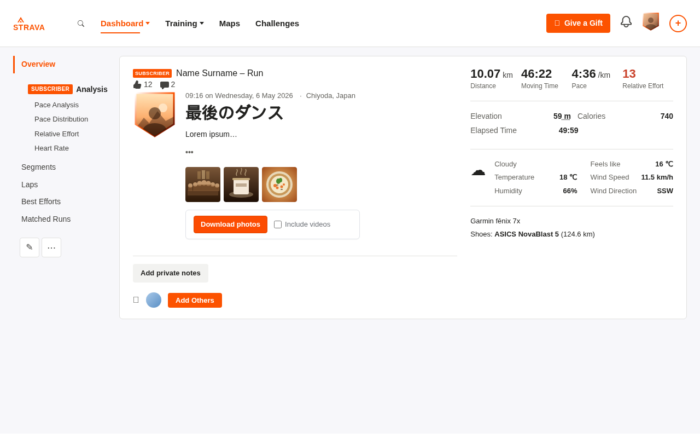 | 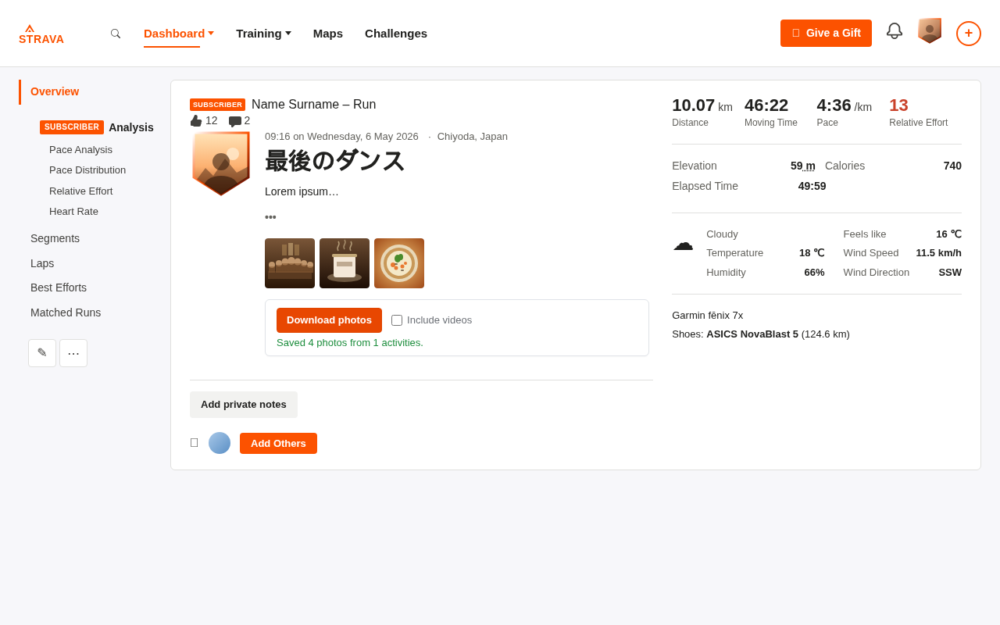 |

---

## What it does

The extension augments three groups of Strava pages: the activities list (`/athlete/training`), individual activity pages (`/activities/<id>`), and athlete profile photo views (`/athletes/<id>/...`). On each it:

**On the activities list page**, it inserts a toolbar above the table with a Select-all-visible checkbox, an Include-videos toggle, and a primary Download photos button. Each row in the table gets a checkbox at the front and a Photos button at the end. Clicking the row button downloads photos for that single activity. Multi-row selection plus the toolbar button produces a single zip named `strava_photos_<date>.zip` (or `strava_media_<date>.zip` when Include videos is on), one folder per activity, original-resolution photos where Strava exposes them.

**On a single-activity page**, the same toolbar mounts beneath the photo thumbnails inside `#activity-photos-container`, with Select-all and the count widget omitted because the activity is implicit from the URL. The bulk button starts enabled and is labeled Download photos. One click downloads every photo from the current activity as `strava_media_<activity-id>.zip`, with the status message dropping onto its own row beneath the controls so a long "Saved 12 photos…" never gets clipped.

**On every page**, activities with no photos are skipped silently – no empty folders. The toolbar surfaces a `No photos found` warning when none of the selected activities have any media, and a partial-success `Saved N items, skipped M (reason)` warning when some photo fetches fail while others succeed.

Everything else - search, sport filter, date filter, sort, pagination - is Strava's own UI. The extension just hooks into whatever's currently on screen.

## Other features

**Max-resolution photos.** The service worker probes the bare (size-stripped) photo URL before falling back to the `-2048xN` variant Strava renders inline, so the resulting zip contains the upload original whenever the CDN serves it.

**EXIF metadata preserved.** For each JPEG, the service worker writes the activity name into `ImageDescription`, the photo's caption back into the file, and (when Strava recorded them) GPS coordinates into the GPS IFD via `piexifjs`. Apple Photos, Lightroom, and any other library tool will pin the photo on a map automatically. Non-JPEG responses pass through untouched.

**Optional video export.** Tick the toolbar's Include videos checkbox and the run also pulls Strava's HLS streams. The service worker fetches the master `.m3u8`, picks the highest-bandwidth variant, concatenates every `.ts` segment, and bundles the result as `video-NN.ts` inside each activity's folder. Run `ffmpeg -i video-01.ts -c copy video-01.mp4` to remux losslessly to MP4 if you prefer that container.

**Localized UI.** 15 locales ship out of the box; missing keys fall back to English. Chrome picks the right one based on the user's browser language - no extension setting required.

## Why it exists

Strava has no way to bulk-export the photos you've attached to your activities. The official full-account export buried in account settings ships your activity files, but not the photos. Strava's mobile and web UI only lets you save them one tap or right-click at a time.

If you've been on Strava for years and have a few thousand photos in there, that adds up.

## Why a browser extension instead of a hosted service

Two answers, the rest is in [PRIVACY.md](PRIVACY.md):

1. **Trust model.** A hosted service that touched your Strava data would need either your OAuth tokens (the official API has limited photo coverage) or your session cookie (a privacy issue – the cookie grants full account access). A local extension sidesteps both: nothing leaves your browser.
2. **Rate limits.** Strava's per-app rate limits are shared across every user of an app. A hosted service for thousands of people would hit them in minutes. An extension makes requests from each user's own browser session – there is no shared bucket.

The extension fetches photos directly from the same Strava CDN URLs the page itself already exposes. The downloaded files are byte-for-byte identical to what you'd get by right-click → Save image on each one. Bulk mode is just N concurrent same-origin requests, with the responses streamed into a zip in your browser.

## Install

### From the Chrome Web Store

https://chromewebstore.google.com/detail/strava-bulk-photo-export/gjflabjekffabmfdchildjbdkkepacdk

### From source (developer mode)

```bash
git clone https://github.com/mladimatija/strava-bulk-photo-export.git
cd strava-bulk-photo-export
npm install         # also installs git hooks via simple-git-hooks
npm run build       # runs prebuild (icons + kofi + type-check) then vite build
```

Then in Chrome:

1. Open `chrome://extensions`.
2. Toggle **Developer mode** on (top right).
3. Click **Load unpacked**.
4. Select the `dist/` folder.

After a `git pull`, run `npm run build` again and click the reload icon next to the extension in `chrome://extensions`.

## Use

1. Log in to <https://www.strava.com> if you aren't already.
2. Either visit <https://www.strava.com/athlete/training> for the activities list or open any single activity at <https://www.strava.com/activities/<id>>.
3. On the list page, use Strava's own search and filters to scope the list. On a single activity, look at the toolbar beneath the photo strip.
4. Click the per-row **Photos** button, the toolbar **Download photos** button (after ticking some rows on the list page, or unconditionally on a single activity), and optionally tick **Include videos** first if you want HLS streams downloaded alongside the photos.

The download respects Strava's pagination – only currently visible rows can be checked on the list page. To download more than one page's worth, page through and download each page's batch.

## Development

```bash
npm run dev         # vite dev server with HMR
npm run check       # lint + format:check + type-check (CI gate)
npm run lint        # eslint .  /  npm run lint:fix to autofix
npm run format      # prettier --write .  /  format:check for verification only
npm run type-check  # tsc --noEmit; runs automatically as part of prebuild
npm run build       # type-check + production build to dist/
npm run icons       # regenerate icon PNGs from icons/icon.svg
npm run kofi        # refetch Ko-fi button asset into src/kofi-asset.ts
npm run promo       # regenerate the Chrome Web Store promo tiles into docs/store/
npm run package     # builds and zips dist/ into strava-bulk-photo-export.zip for store upload
```

The project layout:

```
.
├── manifest.json           # MV3 manifest, declares content-script matches + CDN host_permissions
├── tsconfig.json           # strict TS config, bundler-style resolution
├── vite.config.ts          # @crxjs/vite-plugin + inline manifest version sync
├── eslint.config.mjs       # flat config, type-aware TS rules scoped to src/
├── prettier.config.cjs     # 2-space tabs, single quotes, 120 print width
├── icons/icon.svg          # source for the icon; PNGs generated via npm run icons
├── scripts/
│   ├── clean.js            # wipes dist/ before each build
│   ├── build-icons.js      # sharp-based SVG → PNG renderer
│   ├── build-kofi.js       # fetches kofi6.png and emits src/kofi-asset.ts
│   └── build-promo.js      # composites Chrome Web Store promo tiles from the icon
├── src/
│   ├── content.ts          # mounts the list-mode + single-mode toolbars and per-row controls
│   ├── background.ts       # MV3 service worker: CDN fetch proxy + EXIF injection + HLS muxer
│   ├── photo-downloader.ts # photo + video discovery and bulk zip orchestration
│   ├── i18n.ts             # typed t() helper backed by chrome.i18n
│   ├── types.ts            # shared interfaces (ActivityRow, ProgressEvent, BulkResult, …)
│   ├── kofi-asset.ts       # generated base64 data URL for the Ko-fi button
│   └── styles.css          # toolbar + row styling, sbpx-* namespaced, includes dark-mode overrides
└── tests/
    ├── fixtures/
    │   ├── extension.ts        # Playwright fixture that boots Chromium with the unpacked extension
    │   ├── strava-training.html # mock of /athlete/training (5 activities, mixed indoor + outdoor)
    │   └── strava-activity.html # mock of /activities/<id>, full Strava-style chrome
    ├── e2e/extension.spec.ts   # behavior tests against both fixtures
    └── screenshots/capture.spec.ts # generates docs/screenshots/* and docs/store/screenshot-*.png
```

The repo's version of truth is `package.json.version`. `vite.config.ts` reads it at build time, strips any SemVer prerelease tail (Chrome's manifest format doesn't allow `-beta.1` etc.), and writes the result into `manifest.json.version`. Don't edit `manifest.json.version` by hand. `npm version patch` is the right way to cut a new release.

### Localization

User-facing strings live in `_locales/<code>/messages.json`. English (`en`) is the source of truth; the manifest's `default_locale` is `en` so any string missing from another locale falls back to it. The Chrome i18n system picks the right locale automatically based on the user's browser language – no flag, no extension setting.

Code calls strings through a typed `t()` helper in `src/i18n.ts`:

```ts
import { t } from './i18n.ts';
btn.textContent = t('downloadSelected');
setStatus(t('downloadingProgress', [String(completed), String(total)]), 'info', { spinner: true });
```

The `MessageKey` union in `src/i18n.ts` is the compile-time check: a typo in a key is a TypeScript error, not a silent runtime empty-string.

See [`_locales/README.md`](_locales/README.md) for the list of shipped locales and how to add a new one.

Pre-commit hooks are installed via `simple-git-hooks` + `lint-staged` - they're activated by `npm install` (via the `postinstall` step) and lint/format only staged files on each commit.

### Testing

```bash
npm run test:install     # one-time: install Playwright's bundled Chromium
npm run build            # tests run against dist/, so build first
npm test                 # Playwright E2E suite (tests/e2e/*.spec.ts)
npm run test:screenshots # regenerate docs/screenshots/* and docs/store/screenshot-*.png
```

The E2E suite is split into two describe blocks: list-page behavior (toolbar mount, per-row injection, multi-select, route-override sanity, bare-URL probe + fallback, photos-only success, "no photos found", videos-on HLS path, mixed-success failures, HLS master 404, and a piexifjs EXIF-injection canary) and single-activity-page behavior (toolbar mounts inside `#activity-photos-container`, bulk button starts enabled, status drops to its own row, empty status collapses, one-click download writes `strava_media_<id>.zip`, dark-mode CSS variables flip on `html.dark`). The screenshot suite generates five cropped images for the README and six full-viewport 1280×800 images for the Chrome Web Store listing.

Both suites load the built extension into a real Chromium instance and intercept the matching `strava.com` URL to serve one of the two fixtures in `tests/fixtures/`. The training fixture is a stripped-down activities table; the activity fixture is a fuller replica of `/activities/<id>` with the sidenav, heading, photo strip, weather block, and stats column so screenshots read authentically.

A note on running the tests: the fixture launches Chromium with `headless: false` (a visible window pops up) because Chrome only loads extensions in headful mode - the old headless mode silently ignores `--load-extension`, and Chrome 137+ additionally requires `--disable-features=DisableLoadExtensionCommandLineSwitch` to permit the flag at all. CI wraps the command in `xvfb-run` so Linux runners have a virtual display. On macOS and Windows the visible browser is fine; if you're on a headless Linux dev machine, prefix `npm test` with `xvfb-run --auto-servernum`.

By default, the tests use Playwright's bundled Chromium – pinned to whatever Playwright version is installed, reproducible across machines. To run against your installed Chrome stable instead (closer to what end users have but less reproducible), set `PWTEST_BROWSER=chrome`:

```bash
PWTEST_BROWSER=chrome npm test
```

Same flag set, different binary.

## Privacy

See [PRIVACY.md](PRIVACY.md). The short version: the extension has no backend, no analytics, no telemetry. All requests go to `strava.com` (or Strava's photo / video CDNs) and only when you click a download button.

## Like this?

If it saves you time:

[](https://ko-fi.com/D1D51ZGOQK)

Free either way.

## License

[MIT](LICENSE).

## Disclaimer

This extension is not affiliated with, endorsed by, or sponsored by Strava, Inc. It uses the same internal endpoints and CDN URLs that Strava's own _My Activities_ and activity pages already expose to your browser, on your behalf, while you are logged in to your own account. Use it for personal data export only. Strava's [Terms of Service](https://www.strava.com/legal/terms) apply to your account and your interactions with their service.
